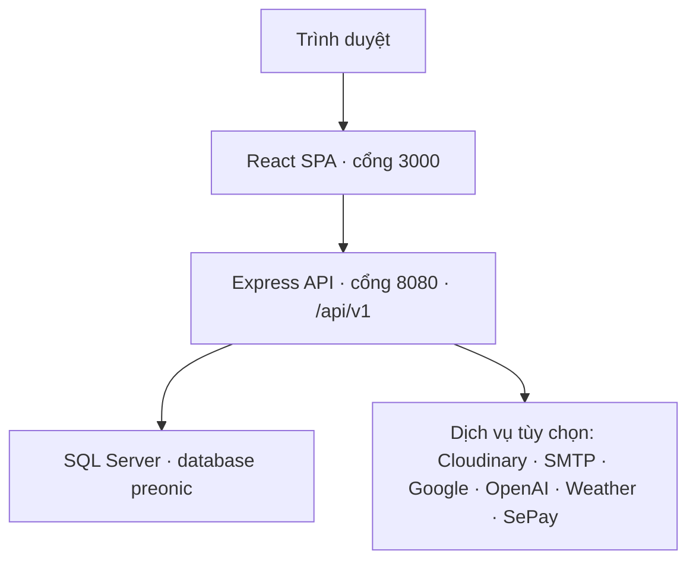
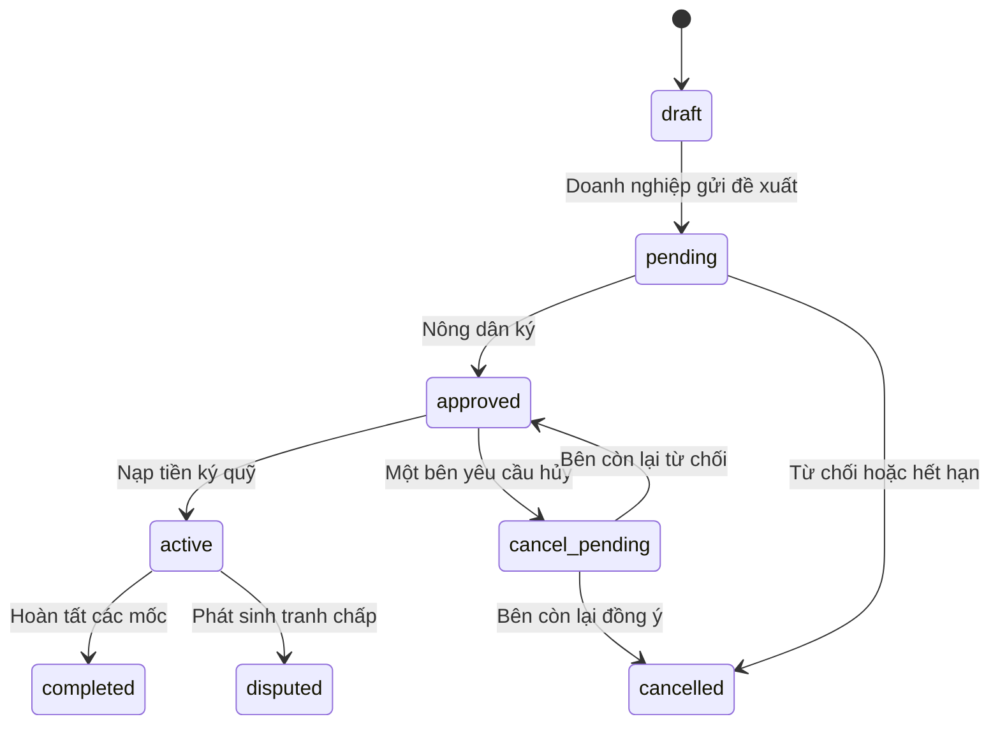

# PreOnic

PreOnic là nền tảng kết nối nông dân với doanh nghiệp trong chuỗi cung ứng nông sản. Hệ thống hỗ trợ đăng bán nông sản, tìm kiếm nhà cung cấp, tạo và ký hợp đồng, ký quỹ theo tiến độ, ví nội bộ, tranh chấp, đánh giá đối tác, nhắn tin, thông báo, thời tiết và quản trị hệ thống.

Tài liệu này được viết theo source hiện tại của dự án và bộ database `Preonic-Database-Final.zip`. Mục tiêu là giúp một người mới có thể hiểu kiến trúc và dựng toàn bộ hệ thống trên máy local mà không phải đọc code trước.

## Mục lục

- [1. Chức năng chính](#1-chức-năng-chính)
- [2. Kiến trúc hệ thống](#2-kiến-trúc-hệ-thống)
- [3. Công nghệ sử dụng](#3-công-nghệ-sử-dụng)
- [4. Cấu trúc dự án](#4-cấu-trúc-dự-án)
- [5. Database và vòng đời nghiệp vụ](#5-database-và-vòng-đời-nghiệp-vụ)
- [6. Yêu cầu môi trường](#6-yêu-cầu-môi-trường)
- [7. Cài đặt và chạy local](#7-cài-đặt-và-chạy-local)
- [8. Tài khoản demo](#8-tài-khoản-demo)
- [9. Biến môi trường và tích hợp ngoài](#9-biến-môi-trường-và-tích-hợp-ngoài)
- [10. Các lệnh phát triển và kiểm thử](#10-các-lệnh-phát-triển-và-kiểm-thử)
- [11. Nhóm API chính](#11-nhóm-api-chính)
- [12. Quy trình kiểm tra hệ thống](#12-quy-trình-kiểm-tra-hệ-thống)
- [13. Xử lý lỗi thường gặp](#13-xử-lý-lỗi-thường-gặp)
- [14. Lưu ý bảo mật và triển khai](#14-lưu-ý-bảo-mật-và-triển-khai)

## 1. Chức năng chính

### 1.1. Người dùng công khai

- Xem trang giới thiệu và danh sách nông sản.
- Lọc nông sản theo từ khóa, danh mục, vùng miền và loại sản phẩm.
- Xem chi tiết sản phẩm, chứng nhận, cam kết, người bán và đánh giá.
- Đăng ký, đăng nhập, xác minh email và đặt lại mật khẩu.
- Đăng nhập bằng Google khi Google OAuth đã được cấu hình.
- Xem thời tiết và sử dụng trợ lý AI công khai khi dịch vụ tương ứng khả dụng.

### 1.2. Nông dân (`farmer`)

- Quản lý hồ sơ nông trại.
- Tạo, sửa, ẩn/xóa và theo dõi nông sản.
- Khai báo mùa vụ, sản lượng, ngày gieo trồng, ngày thu hoạch và tỷ lệ bao phủ.
- Tải ảnh sản phẩm và tệp chứng nhận qua Cloudinary.
- Nhận đề xuất hợp đồng từ doanh nghiệp, ký hoặc từ chối hợp đồng.
- Theo dõi giao hàng, ký quỹ, các mốc thanh toán và dòng tiền.
- Gửi yêu cầu hủy hợp đồng hoặc xác nhận/từ chối yêu cầu hủy từ bên còn lại.
- Mở tranh chấp và gửi bằng chứng.
- Quản lý ví, giao dịch, yêu cầu rút tiền và lịch sử tài chính.
- Đánh giá đối tác sau giao dịch đủ điều kiện.
- Nhắn tin, nhận thông báo và cảnh báo thời tiết.
- Sử dụng trợ lý AI dành cho nông dân khi OpenAI đã được cấu hình.

### 1.3. Doanh nghiệp (`enterprise`)

- Quản lý hồ sơ doanh nghiệp.
- Tìm kiếm nông sản và nhà cung cấp.
- Xem hồ sơ, lịch sử hợp tác và chỉ số uy tín của nông dân.
- Tạo đề xuất hợp đồng theo sản phẩm, số lượng, đơn giá và điều khoản thanh toán.
- Nộp tiền ký quỹ, xác nhận các mốc thực hiện và theo dõi giao hàng.
- Theo dõi hợp đồng, đơn hàng, giao dịch, ví và đánh giá đối tác.
- Mở tranh chấp, nhắn tin và nhận thông báo.
- Xem thời tiết và thông tin bảo hiểm liên quan đến hợp đồng.

### 1.4. Quản trị viên (`admin`)

- Xem tổng quan hệ thống.
- Quản lý người dùng và trạng thái tài khoản.
- Theo dõi hợp đồng, giao dịch và hoa hồng.
- Xử lý tranh chấp.
- Duyệt hoặc từ chối yêu cầu rút tiền.
- Xem nhật ký hệ thống và lỗi API.

## 2. Kiến trúc hệ thống



### 2.1. Frontend

- Ứng dụng React dạng SPA, được tạo bằng `react-scripts`.
- Điều hướng bằng React Router và tách code theo route bằng `React.lazy`.
- Có route riêng cho khách, nông dân, doanh nghiệp và quản trị viên.
- `ProtectedRoute` chặn người chưa đăng nhập hoặc truy cập sai vai trò.
- Axios gọi API qua `REACT_APP_API_URL` và gửi cookie bằng `withCredentials`.
- Access token được lưu trong `sessionStorage`; refresh token được backend đặt trong cookie `httpOnly`.
- Interceptor tự làm mới access token khi API trả `401`.
- Dữ liệu GET công khai của sản phẩm và thời tiết có cache ngắn hạn ở phía trình duyệt.
- Khi database tạm gián đoạn, giao diện hiển thị banner trạng thái thay vì tự xóa phiên đăng nhập.

### 2.2. Backend

- Express + TypeScript, tổ chức theo `routes → controller → service → TypeORM entity`.
- TypeORM kết nối SQL Server qua driver `mssql`.
- Middleware chính gồm Helmet, CORS, cookie parser, Passport, nén response, rate limit, validation và upload.
- API có JWT access token, refresh token cookie, phân quyền theo vai trò và kiểm tra hồ sơ đầy đủ trước các thao tác nghiệp vụ.
- HTTP server vẫn khởi động khi SQL Server tạm thời mất kết nối. Các API cần database trả `503 DATABASE_UNAVAILABLE`; backend tự thử kết nối lại.
- Lỗi máy chủ được ghi vào bảng `SystemLogs` khi database còn khả dụng.

### 2.3. Tác vụ nền

| Tác vụ | Lịch mặc định | Mục đích |
| --- | --- | --- |
| Contract expiry | Mỗi giờ | Hủy đề xuất đã gửi nhưng nông dân không ký trước hạn |
| Shipping | Mỗi giờ | Đồng bộ tiến độ giao hàng và mốc ký quỹ |
| Weather | Mỗi 6 giờ | Cập nhật dữ liệu và cảnh báo thời tiết |
| System log cleanup | 03:00 mỗi ngày | Dọn nhật ký hệ thống cũ |

## 3. Công nghệ sử dụng

| Lớp | Công nghệ chính |
| --- | --- |
| Frontend | React 19, React Router 7, Axios, React Bootstrap, Framer Motion, Recharts, React Toastify |
| Backend | Node.js, Express 4, TypeScript, TypeORM 0.3, Passport, JWT, bcryptjs |
| Database | Microsoft SQL Server, migration TypeORM, stored procedure, view, trigger và index |
| Upload | Multer + Cloudinary |
| Email | Nodemailer + SMTP |
| OAuth | Google OAuth 2.0 |
| Thời tiết | OpenWeatherMap; tự fallback sang Open-Meteo khi không có API key hoặc nhà cung cấp chính lỗi |
| AI | OpenAI Responses API, có endpoint công khai và endpoint dành cho nông dân |
| Thanh toán | Ví nội bộ, QR/top-up demo và tích hợp SePay tùy chọn |
| Kiểm thử backend | Jest + ts-jest |

## 4. Cấu trúc dự án

```text
Preonic/
├── be/                         # Backend Express + TypeScript
│   ├── src/
│   │   ├── config/             # SQL Server, TypeORM CLI, Passport, Cloudinary
│   │   ├── controller/         # Nhận request và trả response
│   │   ├── services/           # Nghiệp vụ chính
│   │   ├── routes/             # Khai báo endpoint và middleware
│   │   ├── models/             # 21 TypeORM entity
│   │   ├── migrations/         # 22 migration lịch sử
│   │   ├── middlewares/        # Auth, validation, upload, rate limit, lỗi
│   │   ├── jobs/               # Cron hợp đồng, giao hàng, thời tiết, log
│   │   ├── seed/               # Script tạo admin tùy chọn
│   │   ├── utils/              # JWT, mật khẩu, rating, response, lock giao dịch
│   │   ├── __tests__/          # Kiểm thử backend
│   │   ├── app.ts              # Middleware và mount API
│   │   └── server.ts           # Khởi động HTTP, database và cron
│   ├── .env.example
│   ├── package.json
│   └── tsconfig.json
├── fe/                         # Frontend React
│   ├── src/
│   │   ├── component/          # UI công khai và dashboard theo vai trò
│   │   ├── routes/             # Public/farmer/enterprise/admin routes
│   │   ├── services/           # Axios client và service gọi API
│   │   ├── contexts/           # Auth, toast, messaging widget
│   │   ├── hooks/              # Hook tải dữ liệu dashboard
│   │   ├── constants/          # Hằng số hợp đồng, escrow, sản phẩm
│   │   ├── utils/              # Ngày giờ, rating, giao dịch
│   │   ├── App.js
│   │   └── index.js
│   ├── .env.example
│   └── package.json
├── README.md                   # Tài liệu này
└── setup_guide.md              # Hướng dẫn cũ; README là tài liệu ưu tiên
```

Không cần giữ hoặc chia sẻ các thư mục `node_modules`, `be/dist`, `fe/build`, `.git`, `__MACOSX` và các file `.DS_Store`. Chúng có thể được cài hoặc sinh lại.

## 5. Database và vòng đời nghiệp vụ

### 5.1. Các bảng chính

Bộ bootstrap hiện tại tạo **21 bảng ứng dụng** và bảng lịch sử `dbo.migrations`.

| Nhóm | Bảng |
| --- | --- |
| Người dùng | `Users` |
| Sản phẩm | `Products`, `ProductCertifications`, `ProductCommitments`, `Reviews` |
| Hợp đồng và ký quỹ | `Contracts`, `Escrows`, `EscrowMilestones`, `EscrowTransactions` |
| Tranh chấp và tài chính | `Disputes`, `DisputeEvidences`, `PaymentTransactions`, `PartnerRatings` |
| Giao tiếp | `Notifications`, `Conversations`, `ConversationParticipants`, `Messages`, `MessageAttachments`, `MessageReadBy` |
| Hỗ trợ vận hành | `WeatherAlerts`, `SystemLogs` |

Schema còn tạo index hiệu năng, trigger cập nhật thời gian, stored procedure sinh mã hợp đồng và view `V_ActiveContracts`.

### 5.2. Vòng đời hợp đồng



Các trạng thái được hỗ trợ trong source và database:

```text
draft → pending → approved → active → completed
                   └→ cancel_pending → cancelled
active → disputed
```

### 5.3. Bootstrap SQL và migration

Bộ `Preonic-Database-Final.zip` chứa:

1. `01_Preonic_CreateDatabase.sql`: tạo database `preonic`, toàn bộ schema cuối, index, trigger, view, stored procedure và đánh dấu 22 migration đã áp dụng.
2. `02_Preonic_SeedData.sql`: tạo dữ liệu demo gồm 2 tài khoản, 10 sản phẩm, 8 hợp đồng đủ trạng thái và dữ liệu escrow, tranh chấp, chat, thông báo, đánh giá.

Với database local mới, ưu tiên chạy hai file SQL trên và giữ:

```env
DB_SYNCHRONIZE=false
```

Sau khi bootstrap, không cần chạy `migration:run`; bảng `dbo.migrations` đã được điền để TypeORM không chạy lại các thay đổi đã gộp vào schema.

## 6. Yêu cầu môi trường

### Bắt buộc

- Node.js **20.x hoặc mới hơn**. Một số dependency backend hiện yêu cầu Node 20.
- npm đi kèm Node.js.
- Microsoft SQL Server 2019+ hoặc SQL Server 2022.
- Công cụ chạy SQL như SQL Server Management Studio, Azure Data Studio hoặc SQL Server extension cho VS Code.
- Hai cổng local còn trống:
  - Frontend: `3000`
  - Backend: `8080`
  - SQL Server: `1433` nếu dùng cổng mặc định.

### Tùy chọn

- Cloudinary để upload ảnh/tệp.
- SMTP để xác minh email và đặt lại mật khẩu.
- Google OAuth để đăng nhập Google.
- OpenAI để bật trợ lý AI.
- OpenWeatherMap; nếu không cấu hình, hệ thống vẫn dùng Open-Meteo miễn phí.
- SePay để tạo QR và nhận webhook nạp tiền thật.

Kiểm tra phiên bản:

```bash
node --version
npm --version
```

## 7. Cài đặt và chạy local

### Bước 1 — Chuẩn bị source

Giải nén source và mở terminal tại thư mục gốc:

```bash
cd Preonic
```

Không dùng `npm start` ở thư mục gốc vì `package.json` gốc không có script khởi động. Frontend và backend phải được cài/chạy trong hai thư mục riêng.

### Bước 2 — Khởi động SQL Server

Nếu đã có SQL Server đang nghe ở `localhost:1433`, chuyển sang Bước 3.

Ví dụ chạy SQL Server 2022 bằng Docker:

```bash
docker run \
  --name preonic-sql \
  -e ACCEPT_EULA=Y \
  -e MSSQL_SA_PASSWORD='Your_Strong_Password_123!' \
  -p 1433:1433 \
  -d mcr.microsoft.com/mssql/server:2022-latest
```

Kiểm tra container:

```bash
docker ps
```

Mật khẩu SQL Server phải đủ mạnh theo chính sách của SQL Server. Không sử dụng mật khẩu ví dụ khi triển khai thật.

### Bước 3 — Tạo database

Giải nén `Preonic-Database-Final.zip`, mở SQL editor và kết nối bằng tài khoản có quyền tạo database.

Chạy đúng thứ tự:

1. `01_Preonic_CreateDatabase.sql`
2. `02_Preonic_SeedData.sql`

File thứ nhất chỉ chạy trên database chưa có bảng. Nếu muốn tạo lại hoàn toàn database local, chạy đoạn sau trước:

```sql
USE master;
GO

IF DB_ID(N'preonic') IS NOT NULL
BEGIN
    ALTER DATABASE [preonic]
    SET SINGLE_USER WITH ROLLBACK IMMEDIATE;

    DROP DATABASE [preonic];
END;
GO
```

> Đoạn lệnh trên xóa toàn bộ database `preonic` và mọi dữ liệu bên trong. Chỉ dùng khi chắc chắn cần reset môi trường local.

Sau khi chạy hai file, kiểm tra:

```sql
USE preonic;
GO

SELECT COUNT(*) AS ApplicationTableCount
FROM INFORMATION_SCHEMA.TABLES
WHERE TABLE_SCHEMA = 'dbo'
  AND TABLE_TYPE = 'BASE TABLE'
  AND TABLE_NAME <> 'migrations';

SELECT Email, Role, IsActive, IsVerified
FROM dbo.Users
ORDER BY Role, Email;
```

Kết quả mong đợi là 21 bảng ứng dụng và có hai tài khoản demo farmer/enterprise.

### Bước 4 — Cài đặt backend

Mở terminal thứ nhất:

```bash
cd Preonic/be
npm ci
```

Tạo `.env` từ file mẫu.

macOS/Linux:

```bash
cp .env.example .env
```

Windows PowerShell:

```powershell
Copy-Item .env.example .env
```

Điền tối thiểu các giá trị sau vào `be/.env`:

```env
NODE_ENV=development
PORT=8080
API_PREFIX=/api/v1

DB_HOST=localhost
DB_PORT=1433
DB_DATABASE=preonic
DB_USERNAME=sa
DB_PASSWORD=YOUR_SQL_SERVER_PASSWORD
DB_ENCRYPT=false
DB_TRUST_SERVER_CERTIFICATE=true
DB_SYNCHRONIZE=false
DB_LOGGING=false

JWT_SECRET=REPLACE_WITH_A_LONG_RANDOM_SECRET
JWT_EXPIRE=7d
JWT_REFRESH_SECRET=REPLACE_WITH_A_DIFFERENT_LONG_RANDOM_SECRET
JWT_REFRESH_EXPIRE=30d

FRONTEND_URL=http://localhost:3000
AUTH_COOKIE_SAME_SITE=strict
AUTH_COOKIE_SECURE=false
```

`JWT_SECRET` và `JWT_REFRESH_SECRET` phải là hai chuỗi dài, ngẫu nhiên và khác nhau. Có thể tạo từng chuỗi bằng:

```bash
node -e "console.log(require('crypto').randomBytes(48).toString('hex'))"
```

Chạy backend:

```bash
npm run dev
```

Backend hoạt động tại:

```text
http://localhost:8080
http://localhost:8080/api/v1
```

Kiểm tra HTTP server:

```bash
curl http://localhost:8080/health
```

Response có dạng:

```json
{
  "status": "success",
  "message": "PreOnic API is running",
  "timestamp": "..."
}
```

Endpoint `/health` chỉ xác nhận HTTP server đã chạy. Để xác nhận database, kiểm tra terminal backend có dòng `SQL Server Connected` hoặc gọi:

```bash
curl http://localhost:8080/api/v1/products
```

Nếu database chưa kết nối, các API cần dữ liệu trả `503` với mã `DATABASE_UNAVAILABLE`.

### Bước 5 — Cài đặt frontend

Mở terminal thứ hai:

```bash
cd Preonic/fe
npm ci
```

Tạo `fe/.env`.

macOS/Linux:

```bash
cp .env.example .env
```

Windows PowerShell:

```powershell
Copy-Item .env.example .env
```

Đặt lại đúng hai giá trị sau:

```env
REACT_APP_API_URL=http://localhost:8080/api/v1
PORT=3000
```

> `fe/.env.example` trong source hiện đang ghi cổng `5000/8000`, nhưng cấu hình chạy thực tế của dự án là backend `8080` và frontend `3000`. Không dùng nguyên giá trị cũ nếu chưa sửa.

Chạy frontend:

```bash
npm start
```

Mở trình duyệt tại:

```text
http://localhost:3000
```

### Bước 6 — Thứ tự chạy mỗi ngày

Sau lần cài đặt đầu tiên, trình tự khởi động là:

1. Khởi động SQL Server.
2. Mở terminal tại `Preonic/be` và chạy `npm run dev`.
3. Mở terminal tại `Preonic/fe` và chạy `npm start`.
4. Truy cập `http://localhost:3000`.

## 8. Tài khoản demo

Sau khi chạy `02_Preonic_SeedData.sql`:

| Vai trò | Email | Mật khẩu |
| --- | --- | --- |
| Nông dân | `farmer.demo@preonic.vn` | `password` |
| Doanh nghiệp | `enterprise.demo@preonic.vn` | `password` |

Hai tài khoản này chỉ dành cho local/demo. Không sử dụng mật khẩu này cho môi trường có dữ liệu thật.

### Tạo tài khoản admin

Seed SQL không tạo sẵn admin. Thêm vào `be/.env`:

```env
ADMIN_SEED_EMAIL=admin@preonic.local
ADMIN_SEED_PASSWORD=REPLACE_WITH_AT_LEAST_12_CHARACTERS
ADMIN_SEED_FIRST_NAME=Admin
ADMIN_SEED_LAST_NAME=PreOnic
```

Sau đó chạy trong thư mục `be`:

```bash
npx ts-node src/seed/createAdmin.ts
```

Script không tạo trùng. Nếu email đã tồn tại với vai trò khác, script sẽ nâng tài khoản đó thành `admin` và kích hoạt tài khoản.

## 9. Biến môi trường và tích hợp ngoài

### 9.1. Biến bắt buộc để chạy chức năng cốt lõi

| Biến | Ví dụ | Ý nghĩa |
| --- | --- | --- |
| `PORT` | `8080` | Cổng backend |
| `API_PREFIX` | `/api/v1` | Prefix chung của API |
| `DB_HOST` | `localhost` | Máy chủ SQL Server |
| `DB_PORT` | `1433` | Cổng SQL Server |
| `DB_DATABASE` | `preonic` | Tên database |
| `DB_USERNAME` | `sa` | Tài khoản SQL Server |
| `DB_PASSWORD` | Không đưa vào Git | Mật khẩu SQL Server |
| `DB_ENCRYPT` | `false` | Mã hóa kết nối SQL; thường `false` khi local |
| `DB_TRUST_SERVER_CERTIFICATE` | `true` | Chấp nhận self-signed certificate khi local |
| `DB_SYNCHRONIZE` | `false` | Không để TypeORM tự sửa schema |
| `JWT_SECRET` | Chuỗi ngẫu nhiên | Ký access token |
| `JWT_REFRESH_SECRET` | Chuỗi ngẫu nhiên khác | Ký refresh token |
| `FRONTEND_URL` | `http://localhost:3000` | CORS và link email |
| `REACT_APP_API_URL` | `http://localhost:8080/api/v1` | Base URL Axios ở frontend |

### 9.2. Upload Cloudinary

```env
CLOUDINARY_CLOUD_NAME=your_cloud_name
CLOUDINARY_API_KEY=your_api_key
CLOUDINARY_API_SECRET=your_api_secret
```

Backend vẫn khởi động khi thiếu các biến này, nhưng upload ảnh sản phẩm, avatar hoặc bằng chứng tranh chấp sẽ lỗi.

### 9.3. SMTP

```env
SMTP_HOST=smtp.example.com
SMTP_PORT=587
SMTP_USER=your-user
SMTP_PASS=your-password-or-app-password
SMTP_FROM_NAME=PreOnic Platform
SMTP_FROM_EMAIL=noreply@example.com
```

SMTP cần cho xác minh email, quên mật khẩu và email thông báo. Nếu chỉ đăng nhập bằng tài khoản demo đã xác minh, có thể cấu hình phần này sau.

### 9.4. Google OAuth

```env
GOOGLE_CLIENT_ID=your_google_client_id
GOOGLE_CLIENT_SECRET=your_google_client_secret
GOOGLE_CALLBACK_URL=http://localhost:8080/api/v1/auth/google/callback
GOOGLE_ONBOARDING_SECRET=another_long_random_secret
```

Nếu thiếu cấu hình, backend vẫn chạy và ghi cảnh báo rằng Google OAuth chưa được bật.

### 9.5. OpenAI

Các biến thường dùng:

```env
OPENAI_API_KEY=your_openai_api_key
OPENAI_PUBLIC_AI_MODEL=gpt-4o-mini
OPENAI_FARMER_AI_MODEL=gpt-4o-mini
OPENAI_MODERATION_ENABLED=true
AI_GUEST_TOKEN_SECRET=another_long_random_secret
```

Source còn hỗ trợ giới hạn lượt dùng, timeout, reasoning effort và giới hạn output token. Khi không có API key, kiểm tra trạng thái AI qua các endpoint `/ai/public/status` và `/ai/farmer/status`.

### 9.6. Thời tiết

Có thể đặt một trong các biến sau:

```env
OPENWEATHER_API_KEY=your_key
# hoặc OWM_API_KEY=your_key
# hoặc WEATHER_API_KEY=your_key
```

Không bắt buộc: backend tự fallback sang Open-Meteo, dịch vụ không yêu cầu API key.

### 9.7. SePay

```env
SEPAY_BANK_ACCOUNT_NUMBER=your_account_number
SEPAY_BANK_CODE=your_bank_code
SEPAY_ACCOUNT_HOLDER=YOUR_ACCOUNT_HOLDER
SEPAY_WEBHOOK_API_KEY=your_webhook_api_key
SEPAY_QR_BASE_URL=https://qr.sepay.vn/img
```

Không cấu hình SePay thì chức năng ví demo vẫn có thể dùng, nhưng luồng QR/webhook thật không hoạt động.

### 9.8. Cookie, proxy và nhiều frontend origin

Local mặc định:

```env
AUTH_COOKIE_SAME_SITE=strict
AUTH_COOKIE_SECURE=false
REFRESH_COOKIE_MAX_AGE_DAYS=30
```

Khi frontend và backend chạy khác domain qua HTTPS:

```env
AUTH_COOKIE_SAME_SITE=none
AUTH_COOKIE_SECURE=true
```

Nếu có nhiều origin frontend:

```env
FRONTEND_URL=http://localhost:3000
FRONTEND_URLS=https://staging.example.com,https://preview.example.com
```

Chỉ cấu hình `TRUST_PROXY` khi backend thực sự nằm sau reverse proxy/load balancer đáng tin cậy.

## 10. Các lệnh phát triển và kiểm thử

### Backend — chạy trong `Preonic/be`

| Lệnh | Mục đích |
| --- | --- |
| `npm ci` | Cài dependency đúng theo `package-lock.json` |
| `npm run dev` | Chạy TypeScript với hot reload |
| `npm run build` | Biên dịch `src/` sang `dist/` |
| `npm start` | Chạy bản đã build từ `dist/server.js` |
| `npm run migration:run` | Chạy migration chưa áp dụng |
| `npm run migration:revert` | Hoàn tác migration cuối |
| `npm run migration:generate --name=TenMigration` | Sinh migration mới |
| `npx jest --runInBand` | Chạy toàn bộ kiểm thử backend |
| `npx ts-node src/seed/createAdmin.ts` | Tạo hoặc nâng cấp tài khoản admin |

`be/package.json` hiện chưa khai báo script `test`, vì vậy dùng `npx jest --runInBand` thay cho `npm test`.

Các script `lint` và `format` đã có trong `package.json`, nhưng source hiện chưa khai báo `eslint` và `prettier` trong `devDependencies`. Chỉ dùng chúng sau khi bổ sung các package/config tương ứng.

### Frontend — chạy trong `Preonic/fe`

| Lệnh | Mục đích |
| --- | --- |
| `npm ci` | Cài dependency theo lockfile |
| `npm start` | Chạy dev server |
| `npm run build` | Tạo production build trong `fe/build` |
| `npm test -- --watchAll=false --passWithNoTests` | Chạy test runner một lần; source hiện chưa có test frontend |

### Kiểm tra trước khi bàn giao code

```bash
cd Preonic/be
npm run build
npx jest --runInBand

cd ../fe
npm run build
npm test -- --watchAll=false --passWithNoTests
```

## 11. Nhóm API chính

Base URL local:

```text
http://localhost:8080/api/v1
```

| Nhóm | Prefix | Nội dung |
| --- | --- | --- |
| Health | `/health` | Kiểm tra HTTP server, nằm ngoài `/api/v1` |
| Auth | `/auth` | Đăng ký, đăng nhập, refresh, email, Google, hồ sơ, mật khẩu |
| Products | `/products` | Sản phẩm, sản phẩm của farmer, sản phẩm tương tự, review |
| Contracts | `/contracts` | Tạo, gửi, ký, từ chối, hủy và thống kê hợp đồng |
| Enterprise | `/enterprise` | Danh sách và chi tiết nhà cung cấp |
| Escrow | `/escrow` | Ký quỹ, tổng quan và xác nhận milestone |
| Disputes | `/disputes` | Tạo, liệt kê và xem tranh chấp |
| Wallet | `/wallet` | Số dư, giao dịch, top-up, rút tiền, SePay và demo QR |
| Notifications | `/notifications` | Danh sách, số chưa đọc và đánh dấu đã đọc |
| Messaging | `/messaging` | Hội thoại, tin nhắn và trạng thái đã đọc |
| Partner ratings | `/partner-ratings` | Đối tác đủ điều kiện và đánh giá sau hợp đồng |
| Weather | `/weather` | Thời tiết, dự báo, tỉnh thành, ngưỡng và cảnh báo |
| AI | `/ai` | Trợ lý công khai và trợ lý dành cho farmer |
| Admin | `/admin` | Dashboard, người dùng, hợp đồng, tranh chấp, giao dịch, rút tiền, log |

Các endpoint nghiệp vụ được bảo vệ bằng JWT và kiểm tra vai trò ở backend; việc ẩn route trên frontend không thay thế kiểm tra phân quyền server-side.

## 12. Quy trình kiểm tra hệ thống

Sau khi dựng local, nên kiểm tra theo thứ tự sau.

### 12.1. Kiểm tra hạ tầng

- SQL Server đang chạy và mở cổng `1433`.
- Backend log có `SQL Server Connected`.
- `GET /health` trả `200`.
- `GET /api/v1/products` không trả `DATABASE_UNAVAILABLE`.
- Frontend mở được tại `http://localhost:3000`.

### 12.2. Kiểm tra vai trò farmer

1. Đăng nhập bằng `farmer.demo@preonic.vn`.
2. Mở dashboard farmer.
3. Kiểm tra danh sách 10 sản phẩm và chi tiết sản phẩm.
4. Mở danh sách hợp đồng để kiểm tra các trạng thái mẫu.
5. Kiểm tra escrow, ví, giao dịch, đánh giá, thông báo và chat.

### 12.3. Kiểm tra vai trò enterprise

1. Đăng nhập bằng `enterprise.demo@preonic.vn`.
2. Mở danh sách sản phẩm và nhà cung cấp.
3. Kiểm tra các hợp đồng mẫu, đơn hàng, escrow và giao dịch.
4. Kiểm tra đánh giá, thông báo, chat và thời tiết.

### 12.4. Kiểm tra chức năng tùy chọn

- Upload ảnh khi Cloudinary đã cấu hình.
- Gửi email xác minh/quên mật khẩu khi SMTP đã cấu hình.
- Đăng nhập Google khi OAuth đã cấu hình.
- AI công khai/farmer khi có OpenAI API key.
- QR và webhook SePay khi thông tin ngân hàng đã cấu hình.

## 13. Xử lý lỗi thường gặp

### `Database preonic đã có bảng dữ liệu`

`01_Preonic_CreateDatabase.sql` cố ý dừng để tránh ghi đè database cũ. Dùng database trống hoặc chạy đoạn drop database ở Bước 3 nếu dữ liệu local có thể xóa.

### `Demo user already exists`

Seed đã được chạy trước đó. Không chạy lại nếu dữ liệu demo đã có. Nếu thật sự cần xóa toàn bộ dữ liệu nghiệp vụ, có thể đổi trong file seed:

```sql
DECLARE @RESET_ALL_DATA BIT = 1;
```

Thao tác này xóa dữ liệu ứng dụng hiện có trước khi seed lại.

### Backend trả `503 DATABASE_UNAVAILABLE`

Kiểm tra:

- SQL Server/container đã chạy chưa.
- `DB_HOST`, `DB_PORT`, `DB_DATABASE`, `DB_USERNAME`, `DB_PASSWORD`.
- SQL Server đã bật TCP/IP và cổng `1433` chưa.
- Firewall có chặn cổng không.
- Với local self-signed certificate, đặt `DB_TRUST_SERVER_CERTIFICATE=true`.

Backend vẫn giữ HTTP server hoạt động và tự kiểm tra kết nối lại ở nền.

### `Login failed for user 'sa'`

- Kiểm tra mật khẩu trong `be/.env`.
- Đảm bảo SQL authentication đã được bật.
- Nếu dùng Docker, dùng đúng mật khẩu đã truyền vào `MSSQL_SA_PASSWORD`.
- Đảm bảo database `preonic` đã được tạo.

### CORS chặn request

Đảm bảo:

```env
# be/.env
FRONTEND_URL=http://localhost:3000

# fe/.env
REACT_APP_API_URL=http://localhost:8080/api/v1
```

Không trộn `localhost` và `127.0.0.1` giữa hai phía khi dùng refresh-token cookie.

### Frontend gọi nhầm cổng `5000`

Sửa `fe/.env` thành:

```env
REACT_APP_API_URL=http://localhost:8080/api/v1
PORT=3000
```

Sau khi sửa `.env`, dừng và chạy lại `npm start`.

### Upload file lỗi

- Kiểm tra đủ ba biến Cloudinary.
- Khởi động lại backend sau khi sửa `.env`.
- Kiểm tra loại file và dung lượng theo validation của upload middleware.

### Google OAuth không hoạt động

- Kiểm tra ba biến `GOOGLE_CLIENT_ID`, `GOOGLE_CLIENT_SECRET`, `GOOGLE_CALLBACK_URL`.
- Callback URL trên Google Console phải trùng tuyệt đối với backend.
- Kiểm tra `FRONTEND_URL` vì callback sẽ chuyển người dùng về frontend.

### Email xác minh hoặc reset password không gửi

- Kiểm tra `SMTP_HOST`, `SMTP_PORT`, `SMTP_USER`, `SMTP_PASS`.
- Nếu nhà cung cấp yêu cầu app password, không dùng mật khẩu đăng nhập thông thường.
- Kiểm tra `SMTP_FROM_EMAIL` và `FRONTEND_URL`.

### Port đã được sử dụng

macOS/Linux:

```bash
lsof -i :3000
lsof -i :8080
```

Windows:

```powershell
netstat -ano | findstr :3000
netstat -ano | findstr :8080
```

### `npm ci` thất bại vì lockfile/dependency

- Chạy lệnh đúng trong `be` hoặc `fe`, không chạy ở root.
- Xác nhận đang dùng Node.js 20+.
- Không sao chép `node_modules` từ hệ điều hành khác; cài lại dependency trên máy hiện tại.

## 14. Lưu ý bảo mật và triển khai

- Không commit `.env`, API key, JWT secret, mật khẩu SQL, SMTP hoặc thông tin ngân hàng.
- Source ZIP hiện có thể chứa `.env`; cần loại bỏ file này trước khi chia sẻ repository công khai và thay/rotate mọi secret đã từng bị chia sẻ.
- Không commit `node_modules`, `be/dist`, `fe/build`, log hoặc file upload runtime.
- Giữ `DB_SYNCHRONIZE=false` trên production; quản lý thay đổi schema bằng migration.
- Dùng HTTPS trên production và đặt `AUTH_COOKIE_SECURE=true`.
- Nếu frontend/backend khác site, dùng `AUTH_COOKIE_SAME_SITE=none` cùng HTTPS.
- Chỉ bật `TRUST_PROXY` sau reverse proxy đáng tin cậy.
- Tài khoản demo và QR demo chỉ dành cho phát triển/kiểm thử.
- Build frontend tạo thư mục `fe/build`; máy chủ web phải hỗ trợ SPA fallback về `index.html`.
- Build backend bằng `npm run build`, sau đó chạy `NODE_ENV=production npm start` trong thư mục `be`.

---

## Tóm tắt chạy nhanh

```text
1. Khởi động SQL Server.
2. Chạy 01_Preonic_CreateDatabase.sql.
3. Chạy 02_Preonic_SeedData.sql.
4. Cấu hình be/.env: SQL Server + JWT + FRONTEND_URL=http://localhost:3000.
5. Trong be/: npm ci && npm run dev.
6. Cấu hình fe/.env: API=http://localhost:8080/api/v1, PORT=3000.
7. Trong fe/: npm ci && npm start.
8. Mở http://localhost:3000 và đăng nhập bằng tài khoản demo.
```
